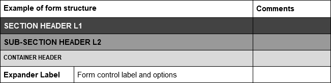

# Introduction

The process of writing pitch documents is constantly evolving, and has gone through many iterations. This document captures the current guidelines for delivering pitches.

We expect this process to evolve over time, and so this document should be treated as a fluid discussion rather than a fixed list of requirements.

# Pitch guidelines

The following guidelines capture the functionality and opinions that we should apply to all steps.

## Ship incrementally

The Steps team has devoted a great deal of effort to building the Step Package architecture, which allows features to be shipped independently of the main Octopus Server code base. This allows us to ship features more frequently, and respond to user feedback more quickly.

To take advantage of this, pitches should be broken down into milestones. Each milestone should:

* Deliver enough value to be useful for our customers.
* Be shippable in 4 weeks or less.
* Lean towards delivering simple solutions that provide an easy migration path should more complexity or additional opinions be required in future milestones.

# Pitch documents

The pitch process generates a number of documents, each with its own use case and audience. These are detailed below.

## RFC blog post

The first document is a Request For Comment (RFC) style blog post. The purpose of this post is to:

* Inform customers, partners, and other internal Octopus departments of the proposed new functionality.
* Highlight the details of the new functionality, calling out how it expresses our vision of best practice deployments.
* Include enough UI mockups to provide a sense of what the feature looks like.
* List the constrains that are being used to shape the milestone, and call out which ones are likely to be delivered in future milestones.
* Provide a link to a [GitHub issue](https://github.com/OctopusDeploy/StepsFeedback/issues) where people can provide feedback.
* But never promise to deliver any specific feature. Always call out that the feature has not been committed to, and that there is no release date.

An example RFC post is available [here](https://octopus.com/blog/rfc-ecs-integration-with-octopus).

## Pitch document

The pitch document is based on the [Shape Up](https://basecamp.com/shapeup/webbook) process.

This document is structured with the following sections:

* Executive Summary - two or three paragraphs outlining how this pitch aligns to the company's strategic goals, why this particular functionality is important, and a high level overview of the proposed solution.
* Problem - A description of the problems faced by customers that this pitch will solve.
* Constraints - Each pitch relates to a milestone, and milestones have been constrained to deliver the smallest unit of useful functionality. This section lists the constraints that exclude work to be done.
* Proposed Scope - This is the opposite of the constraints, and provides an overview of the features to be delivered. This section should link to the blog post and the UI table document.
* Future Considerations - Most pitches expect to be followed up with another related pitch with the next milestone of work. This section provides a very high level list of features that might be considered in the next milestone.

## UI table

This document details the proposed UI structure of the new steps. This is useful when collaborating with the design team to find any unique UX patterns that may need to be incorporated into Octopus:

An example of this document can be found [here](https://docs.google.com/document/d/13jZVn_L6U3_iFEy8W12NO2TochPEu_g_ZNEjo8R652o/edit).

# Post release tasks

There are a number of activities to perform once a new feature is made available:

* [Update Documentation](https://github.com/OctopusDeploy/docs) - Ensure the documentation reflect the new functionality exposed by the steps and targets.
* [Dynamic target scripts](https://octopus.com/docs/infrastructure/deployment-targets/dynamic-infrastructure) - Docs will need to be updated with any new scripts.
* [Uservoice](https://octopusdeploy.uservoice.com/) - Close any suggestions that have now been satisfied.
* [Customer Solutions Product Feedback](https://trello.com/b/vZEB7drD/customer-solutions-product-feedback) - Add a note to any scenario that is now satisfied.
* [Issues Repo](https://github.com/OctopusDeploy/Issues/issues) - Close any issues that have been solved.
* [Feedback Repo](https://github.com/OctopusDeploy/StepsFeedback/issues) - Add a note to any feedback issue created for the milestone, and close the issue.
* [Terraform provider](https://github.com/OctopusDeployLabs/terraform-provider-octopusdeploy) - this will need to be updated with new targets. Ping #team-integrations when the target is available in master.
* [Octopus client](https://github.com/OctopusDeploy/OctopusClients) - this may need to be updated with new target types. This requirement may be removed with step packages.

# References

* [Steps pitch process proposal](https://docs.google.com/document/d/1b94WXWKuGkocP8krgBhjv-mZEWOi2xTNJH_GnZbn360/edit) - A discussion around the limitations of a single pitch document.
* [Account selection for steps](https://docs.google.com/document/d/1MNgIGoE8Jponw9JknGlZylkNThMwd45IOsdkKf8pOok/edit#heading=h.bpy38qfq9mw9) - Why we use targets instead of accounts in steps.
* [Dynamic Environments](https://docs.google.com/document/d/1My5ZLdLeslUq29sQR6xSyEa0UfpwsQxPrXp2dVKZSi4/edit) - Some early thoughts on how dynamic environments might work.
* [Project Groups](https://docs.google.com/document/d/1Yp4dBzGEMVcWWLytjGLMoawjOi0a6hV5yV62MmKWxh4/edit) - Some early thoughts on how project groups might be expanded in future.
* [Pipelines](https://docs.google.com/document/d/184_iYwPtctj5X3a44DdFC-T71dc2nO0vHp1GEtdpbxw/edit) - Early thoughts on how projects can be redesigned to support more complex deployments.
* [Shape Up](https://basecamp.com/shapeup/webbook)
* [The ten pillars of pragmatic deployments](https://octopus.com/blog/ten-pillars-of-pragmatic-deployments)
* [Customer Solutions Product Feedback](https://trello.com/b/vZEB7drD/customer-solutions-product-feedback) - A trello board capturing customer feedback on Octopus.
* [Uservoice](https://octopusdeploy.uservoice.com/)
* [Issues Repo](https://github.com/OctopusDeploy/Issues/issues)
* [Feedback Repo](https://github.com/OctopusDeploy/StepsFeedback/issues)
