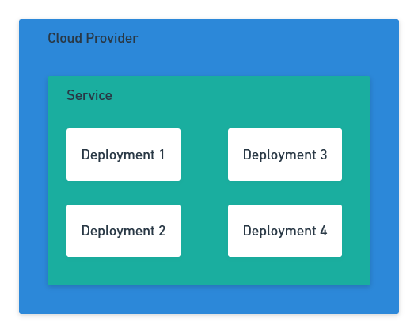
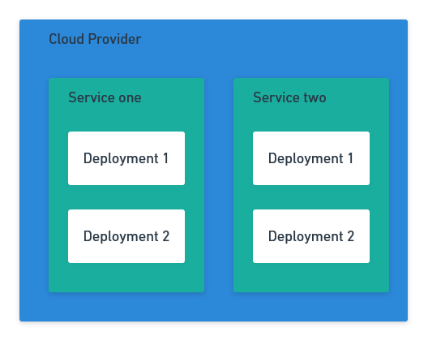

# Introduction

One of the selling points of Octopus is its neutrality. We aim to support all the most popular cloud native platforms, while retaining a consistent user experience and common best practices.

To achieve this, all cloud steps in Octopus should aim to implement a consistent set of base functionality. This document provides guidelines for pitching steps that are consistent, implement the lessons we have learned over the years, and express our opinions on best practice deployments.

# Pitch guidelines

The following guidelines capture the functionality and opinions that we should apply to all steps.

## Ship incrementally

Team steps has devoted a great deal of effort to building a framework that allows features to be shipped independently of the main Octopus code base. This allows us to ship features more frequently, and respond to user feedback more quickly.

To take advantage of this, pitches should be broken down into milestones. Each milestone should:

* Deliver enough value to be useful for our customers.
* Lean towards delivering simple solutions that provide a easy migration path should more complexity be required in future milestones.

## Be opinionated

We are leaders in the deployment space. We have years of experience and our tools have performed millions of deployments, and customers look to us to provide clear opinions on what best practice deployments look like. These values have been distilled into [The ten pillars of pragmatic deployments](https://octopus.com/blog/ten-pillars-of-pragmatic-deployments).

The steps we deliver must have a clear vision for how they enable teams to deliver best practice deployments. Often this involves combining, hiding, not supporting, or hard coding some features in the platforms we deploy to.

Where there is no clear decision on an opinion, refer to **Ship incrementally** for guidance.

## Use targets

Targets must be used to define where a deployment takes place. Targets should capture:

* The credentials required to perform a deployment.
* The default worker a deployment will be performed on.
* Cloud specific details like regions, projects, and resource groups.
* The name of the service being deployed to for a third layer service.
* The default name of the deployable artifact for a second later service. This name must be able to be overridden on the steps.

### Second layer service

A second layer service has only one instance in a cloud provider, and a one to many relationship with the deployments it holds. Examples include:

* AWS Lambdas
* AWS App Runner
* GCP App Engine
* GCP Cloud Run

### Third layer service

A third layer service has a many to one relationship with the cloud provider, and a one to many relationship with the deployments it holds. Examples include:

* Azure web apps
* Kubernetes clusters
* ECS clusters
* Service Fabric
* AWS API Gateway

## Credentialless authentication

All targets should support the ability to inherit credentials from the worker a deployment is executed from, and avoid the need for long lived credentials to be maintained by Octopus.

## Declarative over imperative

All cloud providers and modern orchestration platforms offer a template language for defining resources. They also provide a great deal of tooling and reporting for these "managed" resources. This speaks directly to the [auditable deployments](https://octopus.com/blog/ten-pillars-of-pragmatic-deployments#auditable-deployments) pillar.

Steps should prioritize the creation of resources through declarative templates rather than imperative CLI or SDK commands.

## Graduated path from opinionated to raw scripts

Highly opinionated steps will fail some of our customers all of the time. To support those with advanced use cases, steps must provide a graduated path from opinionated (and often monolithic) steps, to granular and composable steps, to raw templates or scripts.

This path allows us to express our opinions regarding best practice deployments with opinionated steps that will often merge many underlying platforms and resources. The granular steps provide the ability to compose deployments in unique ways, while still retaining the benefits of a UI driven approach. Raw templates or scripts provide the ultimate level of customization, free of the opinions baked into the specialized steps.

# Pitch documents

The pitch process generates a number of documents, each with it's own use case and audience. These are detailed below.

## RFC blog post

The first document is an Request For Comment (RFC) style blog post. The purpose of this post is to:

* Inform customers, partners, and other internal Octopus departments of the proposed new functionality.
* Highlight the details of the new functionality, calling out how it expresses our vision of best practice deployments.
* Include enough UI mockups to provide a sense of what the feature looks like.
* Provide a link to a [GitHub issue](https://github.com/OctopusDeploy/StepsFeedback/issues) where people can provide feedback.
* But never promise to deliver any specific feature. Always call out that the feature has not been committed to, and that there is no release date.

## Pitch document

The pitch document is based on the [Shape Up](https://basecamp.com/shapeup/webbook) process.

This document is structured with the following sections:

* Executive Summary - two or three paragraphs outlining how this pitch aligns to the company's strategic goals, why this particular functionality is important, and a high level overview of the proposed solution.
* Problem - A description of the problems faced by customers that this pitch will solve.
* Constraints - Each pitch relates to a milestone, and milestones have been constrained to deliver the smallest unit of useful functionality. This section lists the constraints that exclude work to be done.
* Proposed Scope - This is the opposite of the constraints, and provides an overview the features to be delivered. This section should link to the blog post and the UI table document.
* Future Considerations - Most pitches expect to be followed up with another related pitch with the next milestone of work. This section provides a very high level list of features that might be considered in the next milestone.

## UI table

This document details the proposed UI structure of the new steps. This is useful when collaborating with the design team to find any unique UX patterns that may need to incorporated into Octopus.