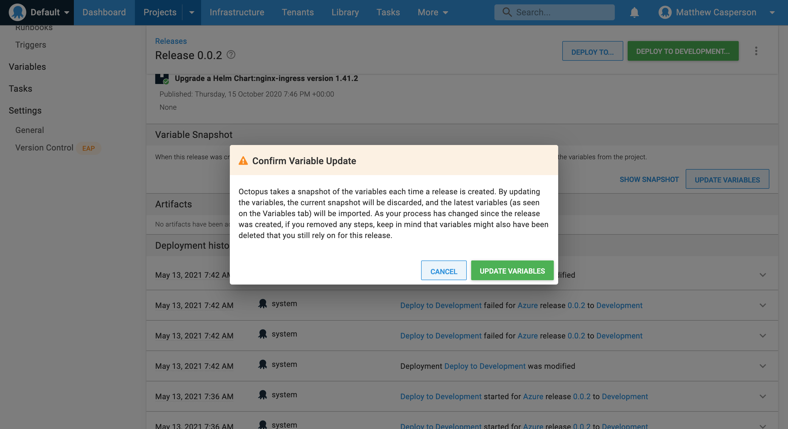

# Introduction

Neutrality is one of the selling points of Octopus. We aim to support all the most popular cloud native platforms, while providing a consistent user experience and common best practices. To achieve this, all new steps in Octopus should aim to implement a consistent set of base functionality. 

This document provides guidelines for designing steps that are consistent and express our opinions on best practice deployments.

# Step design guidelines

We've learned much from previously delivered steps, and learned from many mistakes. Below are guideliness to be aware of when delivering new steps.

## Be opinionated

We are leaders in the deployment space. We have years of experience and our tools have performed millions of deployments, so customers look to us to provide clear opinions on what best practice deployments look like. These values have been distilled into [The ten pillars of pragmatic deployments](https://octopus.com/blog/ten-pillars-of-pragmatic-deployments).

The steps we deliver must have a clear vision for how they enable teams to deliver best practice deployments. Often this involves combining, hiding, not supporting, or hard coding some features in the platforms we deploy to.

Where there is no clear decision on an opinion, refer to **Ship incrementally** from [Delivery Guidelines](DeliveryGuidelines.md) for guidance.

## Graduated path from opinionated steps to raw scripts

Highly opinionated steps will fail some of our customers all of the time. To support those with advanced use cases, steps should provide a graduated path from opinionated (and often monolithic) steps, to granular and composable steps, to raw templates or scripts.

This path allows us to express our opinions regarding best practice deployments with opinionated steps that will often merge many underlying platforms and resources. The granular steps provide the ability to compose deployments in unique ways, while still retaining the benefits of a UI driven approach. Raw templates or scripts provide the ultimate level of customization, free of the opinions baked into the specialized steps.

## Immutable resources and re-use

Octopus allows variables to be updated in an existing release:

Also, not all variables are included in a snapshot. Specifically [tenant variables are not snapshotted](https://octopus.com/blog/defining-variable-templates).

That means that [recoverable deployments](https://octopus.com/blog/ten-pillars-of-pragmatic-deployments#recoverable-deployments) must take into account the fact that all resources may need to be recreated with new variables.

Deployments can not assume immutable resources can be reused with a redeployment.

## Declarative over imperative

All cloud providers and modern orchestration platforms offer a template language for defining resources. They also provide a great deal of tooling and reporting for these "managed" resources. This speaks directly to the [auditable deployments](https://octopus.com/blog/ten-pillars-of-pragmatic-deployments#auditable-deployments) pillar.

Steps should prioritize the creation of resources through declarative templates rather than imperative CLI or SDK commands. This also supports the graduated path from opinionated steps to raw scripts.

## Advanced deployment patterns

Many cloud native platforms have built in support for blue/green or canary deployments. If so, we want to expose these as part of an Octopus deployment where it makes sense. This speaks to the [seamless deployments](https://octopus.com/blog/ten-pillars-of-pragmatic-deployments#seamless-deployments) pillar.

## Prioritize seamless deployments over platform limitations 

We also want to provide support for other deployment scenarios like hotfixes and feature branches. These are often not natively supported by the target platforms.

Where a target platform has functionality that prevents advanced deployment patterns, we'd likely offer an opinionated step that does not use the conflicting functionality so as to promote deployments that enable advanced patterns. An example of this is [AWS API Gateway](https://octopus.com/blog/deploying-lambdas#why-limit-ourselves-to-one-stage-per-environment), whose stages prevent hotfixes and feature branches.

## Calculating networking rules

Watch for platforms that require knowing the current state of network rules configured with previous deployments. For example, many network rules use relative weights for directing traffic e.g. service1 has a traffic weight of 10, service2 has a traffic weight of 20. If we deploy a service3, any weighted value is entirely relative to the weights assigned to the other services, and the outcome is not repeatable.

We should aim to express network traffic as percentages. This may mean translating a percentage into the appropriate weight at deployment time.

## Combine loosely coupled externalized configuration with the deployment

Deployments will often rely on externalized configuration. 

In some cases the configuration is tightly bound to the deployment. For example, environment variables are often defined as part of a deployment, and tightly bound to the application they are configured against.

In other cases two loosely coupled resources will combine to define a deployment. For example, a Kubernetes Pod may reference a ConfigMap for environment variables.

Where two loosely coupled resources must exist side by side for a deployment to operate in a predictable manner, consider an opinionated step that deploys both. This will help customers fall into the pit of success regardless of whether they are using advanced deployment patterns like canary or rolling deployments, or performing a rollback.

Note that it is usually only convenient to create multiple **instantiable** resources within a single step. See the **Use targets** section for a definition of instantiable resources.

## Tags and labels

A failed deployment will often leave a number of old resources laying around. Eventually these need to be cleaned up. This speaks directly to the [auditable deployments](https://octopus.com/blog/ten-pillars-of-pragmatic-deployments#auditable-deployments) pillar.

To identify old resources, anything that can be tagged or labeled should include the following keys (example values are also shown) by default:

* `Octopus.Project.Id`: "projects-1"
* `Octopus.Action.Id`: "8427fd24-17c8-4c7d-b32f-d2b8d51f2121"
* `Octopus.Deployment.Id`: "8427fd24-17c8-4c7d-b32f-d2b8d51f2121"
* `Octopus.RunbookRun.Id`: "runbookruns-86"
* `Octopus.Step.Id`: "b6f8fd75-3acf-4186-a573-285a1aa11a9a"
* `Octopus.Environment.Id`: "environments-4"
* `Octopus.Deployment.Tenant.Id`: "untenanted"

The following are human readable names that allow a resource to be tracked back to a deployment:

* `Octopus.Deployment.Name`: "Deploy to Production"
* `Octopus.Deployment.Tenant.Name`: "Acme Corp"
* `Octopus.Environment.Name`: "Production"
* `Octopus.Project.Name`: "My Project"
* `Octopus.Release.Channel.Name`: "My Channel"
* `Octopus.Space.Name`: "My Space"
* `Octopus.Action.Name`: "Deploy my thing"
* `Octopus.Step.Name`: "Deploy my thing"
* `Octopus.Runbook.Name`: "My runbook"
* `Octopus.RunbookRun.Name`: "My runbook run"
* `Octopus.RunbookSnapshot.Name`: "My snapshot name"
* `Octopus.Machine.Name`: "My target name"

These tags have proven useful for identifying resources related to previous deployments, regardless of environments, tenants etc.

## Output variables

Many deployments will create resources that need to be consumed by subsequent steps. The following are guidelines for output variables:

* Links to any resources accessible via a URL. This helps with testing, and speaks to the [verifiable deployments](https://octopus.com/blog/ten-pillars-of-pragmatic-deployments#verifiable-deployments) pillar.
* Names of any generated resource identifiers.
* Details of any generated revision numbers.